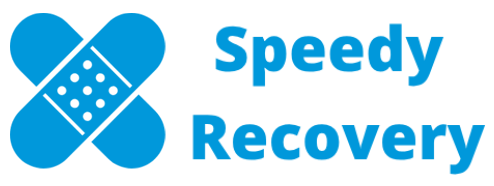

  
  
  

    

# Speedy Recovery
**A patient-centred app based on the FHIR standard facilitating communication between paediatric patients, parents and hospital staff**

## About
[Speedy Recovery](https://speedyrecovery.z6.web.core.windows.net) is a SMART on FHIR enabled web application providing clinical information, a calendars displaying medical appointment, and messaging to paediatric patients, as well as their parents and the relevant healthcare providers. It is developed in a cooperation between University College London (UCL) and Great Ormond Street Hospital (GOSH).

[GOSH](https://www.gosh.nhs.uk/) and their digital unit [GOSH DRIVE (Digital Research Informatics and Virtual Environments)](https://www.goshdrive.com) are committed to making young patients’ hospital stays as tolerable as possible. Inherently, this goal can only be achieved if parents are assured and confident, and hospital staff is well-informed and approachable. 

We aim to use modern technology to help GOSH in their pursuit of their goals and generally explore the potential of patient-centred software in healthcare. Therefore, we will develop a web app that serves three different user groups: patient, parent and provider. The app will display a calendar that is tailored to the respective user’s needs. 

The project makes use of the cutting-edge healthcare data standard FHIR (Fast Healthcare Interoperability Resources), which has only recently left draft phase, and is believed to revolutionise the health IT landscape. The project explores the opportunities of this young, evolving standard, together with the SMART on FHIR technology that builds on top of it.

Within GOSH DRIVE, this is also the first reported usage of the SMART Sandbox in operation. Therefore, this project is also meant as a reference implementation for SMART on FHIR developers looking to implement a web application.

## Front-End
The React client application can be found in the `/speedy-recovery-client` directory.

### Development

#### `yarn install`
Installs all required dependencies. Also, this will implicitly run `patch-package`, a node module that makes slight adjustments to some third party dependencies in the `node_modules` directory. Needs to be run prior to running `yarn start`.

#### `yarn start`
Runs the app in the development mode. Open [http://localhost:3000](http://localhost:3000) to view it in the browser.

The page will reload if you make edits. You will also see any lint errors in the console.

#### `yarn test`

Launches the test runner in the interactive watch mode.

#### `yarn build`

Builds the app for production to the `build` folder. It correctly bundles React in production mode and optimizes the build for the best performance.

The build is minified and the filenames include the hashes.

## SMART on FHIR
For development purposes, the authentication and data access is set up to utilise the SMART Sandbox instead of accessing an actual EHR. Each sandbox configuration corresponds to a unique link. These links can be found in the `config` folder and adjusted as need be.

## FHIR Versions
Currently, we support FHIR DSTU2 and STU3. To add support for a new version, implement a new adapter in the `service` module and adjust the `FhirDataMappingService` to use it accordingly.

## Deployment
The app is currently deployed via Azure DevOps pipelines. Merge your changes into the `master` branch and trigger a release.

## Back-end
Most back-end services are carries out through the SMART on FHIR sandbox. A distinct  back-end is being implemented to add some features and can be found at [speedy-recovery-server](https://github.com/JustinYaaang/speedy-recovery-server/). Further information can be found in the README in that repository.

## Data creation
In order to create test data on the SMART FHIR server, a helper program is available in the `smart-server-data-creation` package. It creates and modifies the synthetic patient data on the SMART on FHIR v3 server, which gets wiped on a nightly basis. Therefore the data creation script is scheduled to run every 3 hours. Further information can be found in the README in that directory.

##  Acknowledgement
We would like to thank John Booth and Usman Bahadur from GOSH DRIVE as well as Marios Isaakidis for their advice throughout this project.

-----

# Licence

_Speedy Recovery -- A patient-centred app based on the FHIR standard facilitating communication between paediatric patients, parents and hospital staff_

_Copyright (C) 2019 University College London_

This program is free software: you can redistribute it and/or modify
it under the terms of the GNU Affero General Public License as published by
the Free Software Foundation, either version 3 of the License, or
(at your option) any later version.

This program is distributed in the hope that it will be useful,
but WITHOUT ANY WARRANTY; without even the implied warranty of
MERCHANTABILITY or FITNESS FOR A PARTICULAR PURPOSE.  See the
GNU Affero General Public License for more details.

You should have received a copy of the GNU Affero General Public License
along with this program.  If not, see <http://www.gnu.org/license/>.

